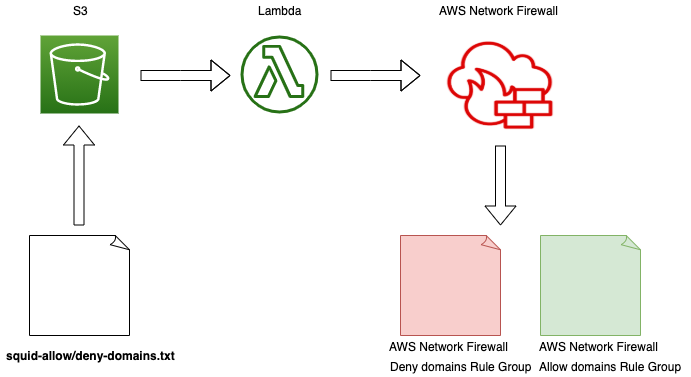

## Migrating to AWS Network Firewall from Squid Web Proxy

The squid transformation tool helps you to create rule groups based out of a list of domains that you may have in your squid configuration file for your egress filtering.

The resources are launched via the CloudFormation. The stack provisions an event trigger for a given S3 bucket and a lambda function which takes a text file with a list of domains as input. The Lambda function takes in a text file containing a list of domains and transforms that into the domain list within a given AWS Network Firewall Rule group.

## Instructions for the tool:
1. Create or designate an S3 bucket which will hold the Lambda function and the text file(s) containing the list of domains.
2. Upload the Lambda function, squid.zip, to the bucket
3. Launch the CFN template.
	a. Input the bucket name
	b. Input the rule group name
	c. Input the name of the text file to look for which will contain the list of domains.
	d. Specify the action i.e. whether the rule group should be an ALLOWLIST or DENYLIST
4. Upload the given text file, which contains the list of domains, to the bucket
5. Verify the rule group configuration is as expected.
6. Use the Lambda's CloudWatch log groups to troubleshoot if the rule group is not created.

At this point, you can update the text file as desired and upload it to the S3 bucket. Everytime that specific file is uploaded, S3 event triggers lambda function which will create a new rule group or update an existing one.

## Instructions for provisioning AWS Network Firewall infrastructure as a standalone template:
1. Log in to the AWS CloudFormation console. 
2. Launch a stack using the template squid-to-aws-network-firewall.yml
3. Provide the necessary parameters.
4. Acknowledge the IAM permissions and create the stack.

## Code Owners

Shiva Vaidyanathan - vaidys@amazon.com

Rashpal Kler - kler@amazon.com

## Security

See [CONTRIBUTING](CONTRIBUTING.md#security-issue-notifications) for more information.

## License

This library is licensed under the MIT-0 License. See the LICENSE file.

